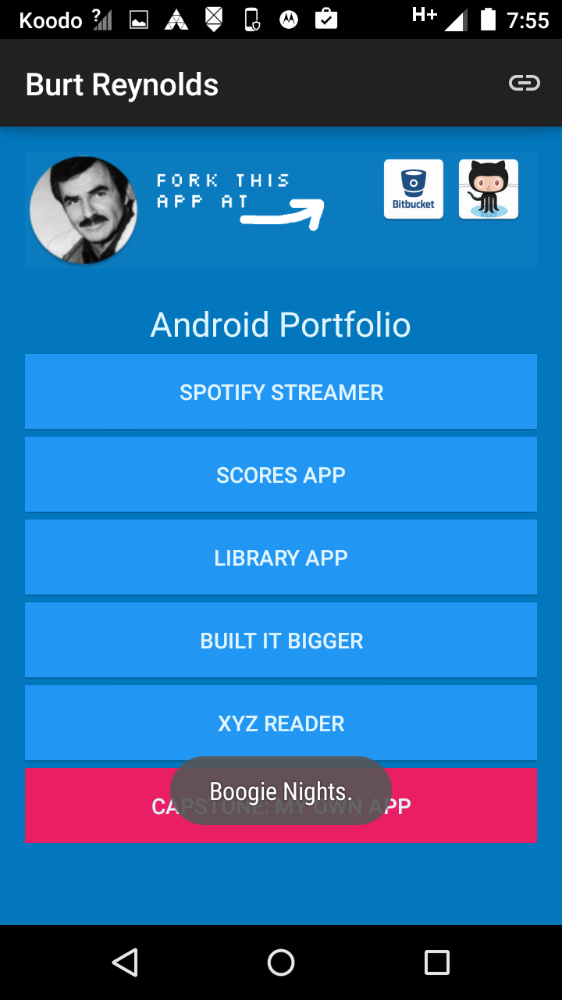
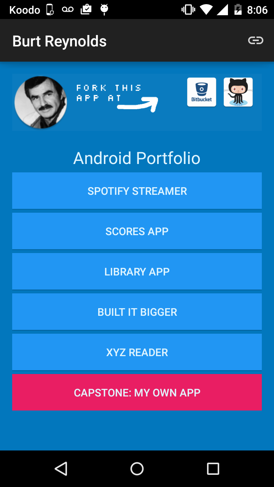
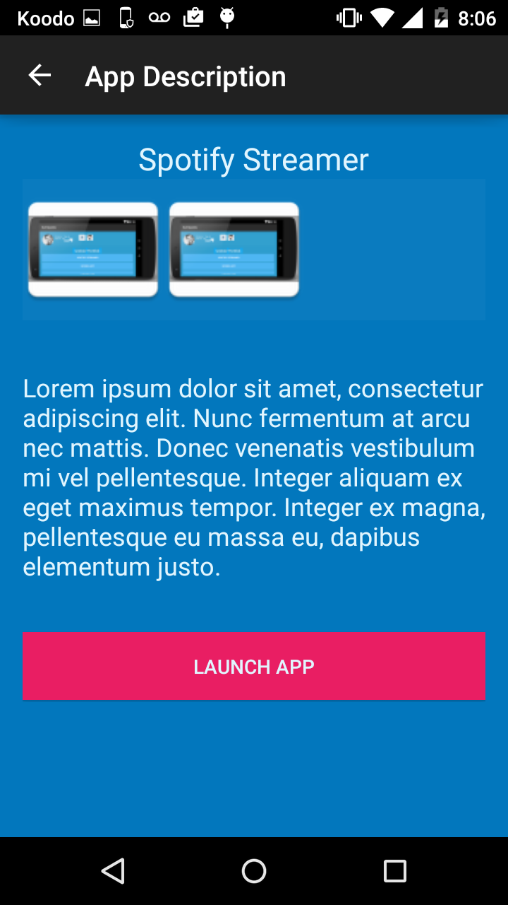
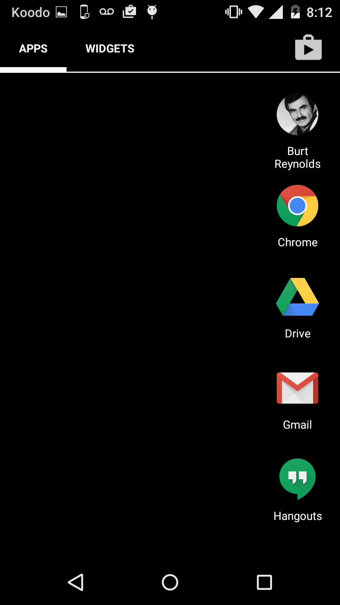
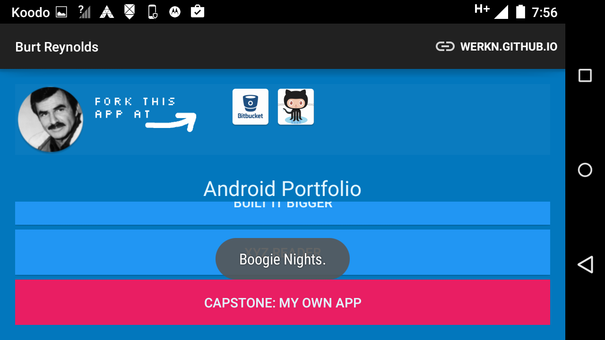

# My App Portfolio
Portfolio App completed for the Android Nanodegree by Udacity

As a joke the display photo is Burt Reynolds, the project is meant to be forked.

The major components to change:

 + Profile pic, found under `mipmap`
 + Site urls found in `MainActivity.java`
 + ActionBar url found under `res\values\strings\` look for `app_action_website`

####Screenshots

 

